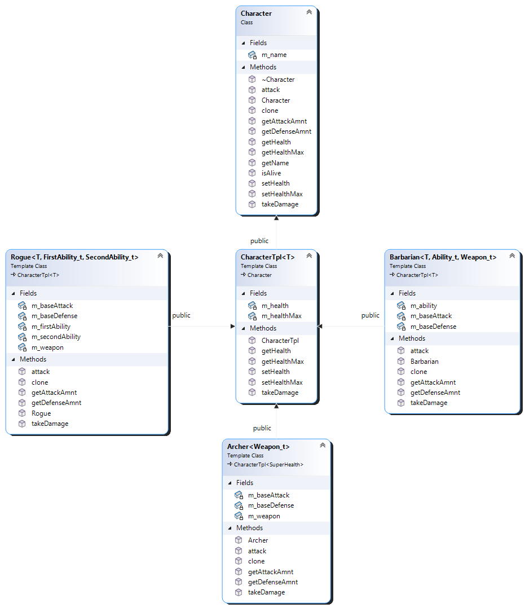

# Overview
This project implements a simplified RPG (Role‑Playing Game) framework using C++ object‑oriented programming techniques.
Players can choose different character classes, each equipped with unique weapons, health types, and special abilities. Characters can join Teams and Guilds, gaining bonuses and interacting through polymorphic behaviour.

## Character Classes
- Character - Abstract base class defining the interface for all characters.
- CharacterTpl<T> - A templated extension of Character that adds health logic.
- Barbarian - Melee fighter with two weapons and one special ability.
- Archer - Ranged fighter using seneca::SuperHealth with single weapon.
- Rogue - Agile fighter with two abilities and a dagger.

  

## Modules

- **Team** – (Composition) Manages a dynamic array of Character*  
- **Guild** – (Aggregation) Manages a dynamic array of Character*   
- **abilities** – Manages a simple special ability logic  
- **weapons** – Manages a weapon damage logic  
- **health** – Manages health behaviour (normal, infinite, super)  
- **character** - Abstract interface for all characters  

## Features
- Creating characters of different classes
- Assigning weapons and abilities
- Joining teams and guilds
- Performing attacks between characters
- Applying damage, defense, and ability effects
- Displaying character states and team/guild rosters

## How to Run the Code
```
g++ *.cpp -o rpg
./rpg
```